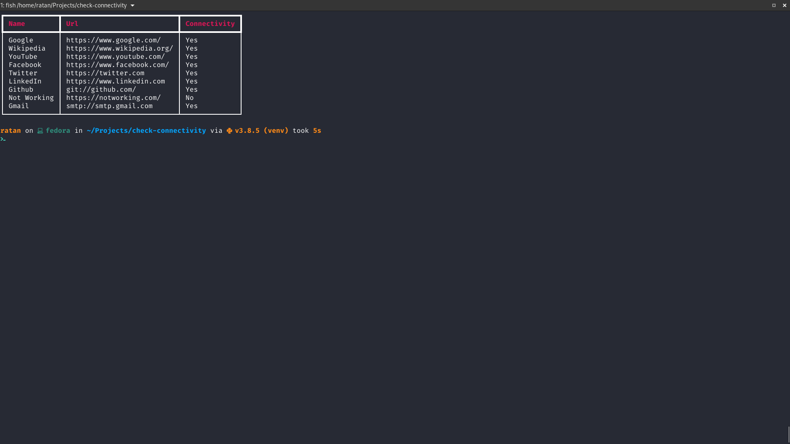

+++
title = "Check Connectivity"
description = "A python script to check if you can connect to certain host and port."
date = 2020-10-02T23:19:47+05:30

[taxonomies]
categories = ["Snippets"]
tags = ["sockets", "networks"]

[extra]
toc = false
+++

You can use the script below to check if you can connect to certain host and port from a list of urls in a CSV file and capture that result in the CSV file.

<!-- more -->

```python
import csv
import sys
import socket
import time
from contextlib import contextmanager
from urllib.parse import urlparse

import trio
from rich.console import Console
from rich.table import Table

BEAT_TIME = 0.04
console = Console()


@contextmanager
def beat(length: int = 1) -> None:
    with console:
        console.clear()
        yield
    time.sleep(length * BEAT_TIME)


async def check_connectivity(hostname, port, *, timeout=0.250):
    try:
        targets = await trio.socket.getaddrinfo(
            hostname, port, type=trio.socket.SOCK_STREAM
        )
    except socket.error:
        return False

    attempt_failed = [trio.Event() for _ in targets]
    winning_socket = None

    async def attempt(which, nursery):
        if which > 0:
            with trio.move_on_after(timeout):
                await attempt_failed[which - 1].wait()

        if which + 1 < len(targets):
            nursery.start_soon(attempt, which + 1, nursery)

        *socket_config, _, socket_target = targets[which]
        try:
            client = trio.socket.socket(*socket_config)
            await client.connect(socket_target)
        except OSError:
            attempt_failed[which].set()
        else:
            nursery.cancel_scope.cancel()
            nonlocal winning_socket
            winning_socket = socket

    async with trio.open_nursery() as nursery:
        nursery.start_soon(attempt, 0, nursery)

    if winning_socket is None:
        return False
    return True


async def main(data_file):

    bool_to_str = {
        True: "Yes",
        False: "No",
    }

    table = Table(show_header=True, header_style="bold magenta")

    connectivity_data = []

    with open(data_file, "rt") as csv_file:
        reader = csv.DictReader(csv_file)

        for field in reader.fieldnames:
            table.add_column(field)

        with beat(10):
            console.print(table)

        for row in reader:
            parsed_url = urlparse(row["Url"])
            connectivity = await check_connectivity(
                parsed_url.netloc, parsed_url.scheme
            )
            row["Connectivity"] = bool_to_str[connectivity]
            data = list(row.values())
            table.add_row(*data)
            connectivity_data.append(row)

            with beat(10):
                console.print(table)


    with open(data_file, "wt") as csv_file:
        writer = csv.DictWriter(csv_file, fieldnames=reader.fieldnames)

        writer.writeheader()

        for row in connectivity_data:
            writer.writerow(row)


if __name__ == "__main__":
    url_list = sys.argv[1]
    trio.run(main, url_list)

```

And the input CSV file might look like something below

| Name        | Url                        | Connectivity | 
|-------------|----------------------------|--------------| 
| Google      | https://www.google.com/    |              | 
| Wikipedia   | https://www.wikipedia.org/ |              | 
| YouTube     | https://www.youtube.com/   |              | 
| Facebook    | https://www.facebook.com/  |              | 
| Twitter     | https://twitter.com        |              | 
| LinkedIn    | https://www.linkedin.com   |              | 
| Github      | git://github.com/          |              | 
| Not Working | https://notworking.com/    |              | 
| Gmail       | smtp://smtp.gmail.com      |              | 


**Output**


| Name        | Url                        | Connectivity | 
|-------------|----------------------------|--------------| 
| Google      | https://www.google.com/    | Yes          | 
| Wikipedia   | https://www.wikipedia.org/ | Yes          | 
| YouTube     | https://www.youtube.com/   | Yes          | 
| Facebook    | https://www.facebook.com/  | Yes          | 
| Twitter     | https://twitter.com        | Yes          | 
| LinkedIn    | https://www.linkedin.com   | Yes          | 
| Github      | git://github.com/          | Yes          | 
| Not Working | https://notworking.com/    | No           | 
| Gmail       | smtp://smtp.gmail.com      | Yes          | 
