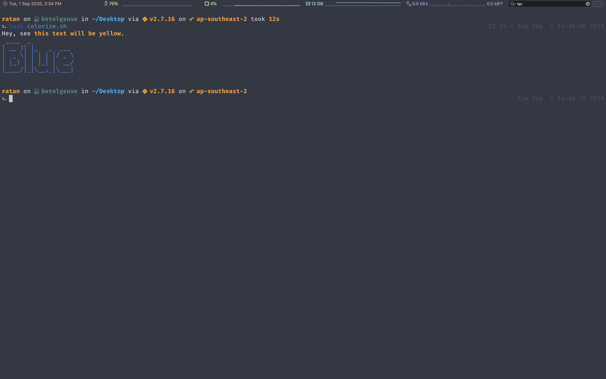

+++
title = "Colorize Script Output"
description = "A bash snippet to make output of your bash scripts colourful."
date = 2020-07-05T23:19:47+05:30

[taxonomies]
categories = ["Snippets"]
tags = ["bash", "scripts", "colorize"]

[extra]
toc = false
+++


You can use the script below to make output of your scripts colourful.

<!-- more -->

```bash
#!/bin/bash
set -eufo pipefail

RED="\033[0;31m"
RED_LIGHT="\033[1;31m"
GREEN="\033[0;32m"
GREEN_LIGHT="\033[1;32m"
BLUE="\033[0;34m"
BLUE_LIGHT="\033[1;34m"
PURPLE="\033[0;35m"
PURPLE_LIGHT="\033[1;35m"
CYAN="\033[0;36m"
CYAN_LIGHT="\033[1;36m"
GRAY="\033[1;30m"
GRAY_LIGHT="\033[0;37m"
ORANGE="\033[0;33m"
YELLOW="\033[1;33m"
BLACK="\033[0;30m"
WHITE="\033[1;37m"
END="\033[0m"

echo -e "Hey, see ${YELLOW}this text will be yellow${END}."

printf "${BLUE}"
cat <<"EOF"
 ____  _            
| __ )| |_   _  ___ 
|  _ \| | | | |/ _ \
| |_) | | |_| |  __/
|____/|_|\__,_|\___|
                    
EOF
printf "${END}"
```

And to see the output just run it like any bash script.

```
$ bash colorize.sh
```

**Output**

